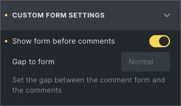

# bricks-comments-addon

I wanted the comments form to appear above the list of comments, so I added a control to the comment element.

## Technical stuff

If the setting is true, the elements `.comments-title` and `.comment-list` will be wrapped with `

` and a CSS file will be enqueued.

It also ass a skiplink to the comments form right after `
`.

### CSS

The `.bricks-comments-inner` will get `display: grid` and `.comments_wrapper`will get `order: 1`.