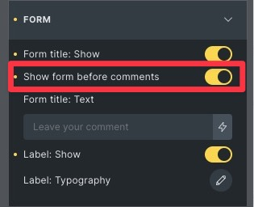

# bricks-comments-addon

I wanted the comments form to appear above the list of comments, so I added a control to the comment element.

## Technical stuff

To achive this the plugin simply determins if the box is checked. If so, it registers two files (a JS and a CSS).

### JS

Nothing special here. Just wrapping the `.comments-title` and `.comment-list` with `

`. This automatically bringt up the form in front of the comments listing.

### CSS

Just giving the `.comments__wrapper` a little `margin-top: 40px`