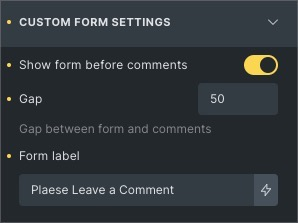

=== bricks-comments-addon ===
Plugin Name: Bricks Comments Addon
Plugin URI: https://github.com/emmgeede/bricks-comments-addon
Description: Adds a couple of settings to the bricks comment element
Vsersion: 1.0.3
$Author: Michael Großklos
Author URI: https://emmgee.de
License: GPL2
License URI: https://www.gnu.org/licenses/gpl-2.0.html
Text Domain: bricks
Minimum WP Version: 6.5
Minimum PHP Version: 8.1

I wanted the comments form to appear above the list of comments, so I added a control to the comment element.

## Fields

### Show form before comments

If checked, the comments form appears before the comments.

### Gap ***(only visible if "Show form before comments" is checked)***

Sets the gap between the form and the comments below. The default unit is `px` but `em, rem, %` units can also be used.

### Form Label

The standard label of the form is `Comment *`. With this field it can be changed to what ever you want. The `*` will be
included automatically so leave it out.

If you want to change the CSS of the `*` you can use the `.required` class or target the `` within the `<label
for="comment">`.

## Technical stuff

If the setting is true, the elements `.comments-title` and `.comment-list` will be wrapped with `

` and a CSS file will be enqueued.

It also adds a skiplink to the comments form right after `
`.

### CSS

The `.bricks-comments-inner` will get `display: grid` and `.comments_wrapper`will get `order: 1`.